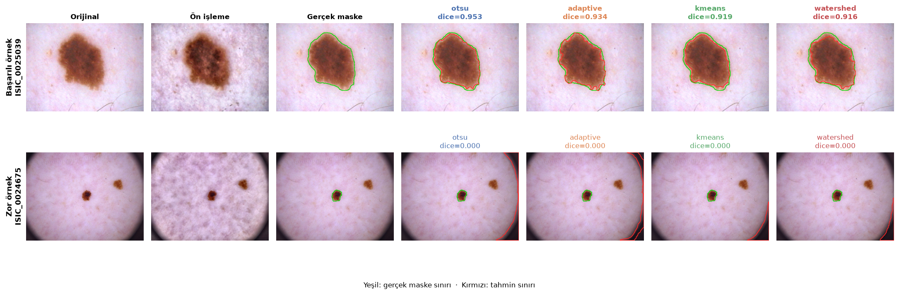
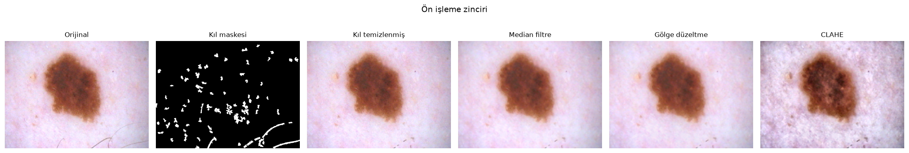

# Deri Lezyonu Segmentasyonu — Klasik Görüntü İşleme

Dermoskopi görüntülerinde lezyon sınırını **derin öğrenme kullanmadan** bulan bir
pipeline. Dört segmentasyon yöntemi, ortak ön işleme ve son işleme zinciri üzerinde
adil biçimde karşılaştırılıyor ve sonuçlar istatistiksel testle doğrulanıyor.



> Terminoloji: **pipeline** baştan sona akışın tamamını, **zincir** ise ön işleme ya da
> son işleme alt dizisini anlatır.

## Sonuçlar

**HAM10000** veri setinden **1000 görüntü** üzerinde ölçüldü
(ortalama lezyon alanı: görüntünün %25,4'ü). Ham sonuçlar: [`docs/results_1000.csv`](docs/results_1000.csv)

| Yöntem | IoU | **Dice** | Dice (medyan) | Duyarlılık | Kesinlik | Doğruluk | XOR hata ↓ | HD95 ↓ | ASSD ↓ |
|--------|-----|----------|---------------|------------|----------|----------|-----------|--------|--------|
| **otsu_plus** ¹ | **0,781** | **0,855** | **0,924** | **0,906** | 0,846 | **0,922** | 0,917 ² | **52,6** | **20,3** |
| otsu | 0,624 | 0,737 | 0,815 | 0,648 | 0,905 | 0,891 | **0,625** | 78,0 | 34,8 |
| watershed | 0,447 | 0,580 | 0,658 | 0,449 | 0,924 | 0,844 | 0,626 | 107,7 | 53,0 |
| kmeans | 0,435 | 0,565 | 0,636 | 0,437 | **0,929** | 0,835 | 0,628 | 109,0 | 53,3 |
| adaptive | 0,373 | 0,499 | 0,522 | 0,387 | 0,888 | 0,816 | 0,723 | 119,8 | 49,8 |

↓ = küçük değer daha iyi. Dice standart sapması dört temel yöntemde 0,23–0,26, otsu_plus'ta 0,19.

¹ Kendine göre ayarlanmış ön/son işleme kullanan geliştirilmiş Otsu — ayrıntılar
[aşağıda](#otsu_plus-skoru-nasıl-artırıldı). Diğer dört yöntem ortak zinciri paylaşır.
² Ortalama XOR birkaç aykırı değere bağlı: küçük lezyonlarda fazla bölütleme olunca
lezyon alanına normalize edilen hata çok büyüyor. XOR > 3 olan görüntü sayısı otsu'da 32,
otsu_plus'ta 38. Buna karşılık **medyan XOR otsu'da 0,320, otsu_plus'ta 0,155** (yarıya
iniyor); XOR > 3 olanlar hariç ortalama otsu'da 0,396, otsu_plus'ta 0,259.

**Temel yöntemler arasında kazanan Otsu; geliştirilmiş hali otsu_plus genel olarak en
iyisi.** Otsu, dört temel yöntem içinde hem en yüksek örtüşmeyi hem de en iyi sınır
kalitesini (HD95, ASSD) veriyor — ve farkı küçük değil. otsu_plus ise kesinlik ve
ortalama XOR dışındaki tüm metriklerde Otsu'yu geçiyor.

| Yöntem | Dice > 0,8 olan görüntü | Tamamen başarısız (Dice < 0,05) |
|--------|------------------------|--------------------------------|
| otsu_plus | **%82,6** | **%1,8** |
| otsu | %55,4 | %4,9 |
| watershed | %16,4 | %6,9 |
| kmeans | %16,3 | %6,3 |
| adaptive | %12,9 | %5,1 |

### Farklar anlamlı mı?

Aynı 1000 görüntü üzerinde eşleştirilmiş **Wilcoxon işaretli sıra testi**:

| A | B | Dice A | Dice B | Fark | A'nın kazandığı görüntü | p | Anlamlı |
|---|---|--------|--------|------|------------------------|---|---------|
| otsu | watershed | 0,737 | 0,580 | +0,157 | %93,6 | <0,0001 | ✔ |
| otsu | kmeans | 0,737 | 0,565 | +0,172 | %96,1 | <0,0001 | ✔ |
| otsu | adaptive | 0,737 | 0,499 | +0,238 | %91,1 | <0,0001 | ✔ |
| watershed | adaptive | 0,580 | 0,499 | +0,081 | %60,8 | <0,0001 | ✔ |
| kmeans | adaptive | 0,565 | 0,499 | +0,066 | %56,8 | <0,0001 | ✔ |
| watershed | kmeans | 0,580 | 0,565 | +0,014 | %54,1 | 0,012 | ✔ (ama önemsiz) |

Otsu'nun üstünlüğü hem büyük hem tutarlı: görüntülerin %91–96'sında diğerlerini yeniyor.
Buna karşılık watershed ile k-means arasındaki fark istatistiksel olarak anlamlı
(p = 0,012) ama **pratikte önemsiz** — 0,014 Dice farkı ve görüntülerin yalnızca
%54'ünde kazanıyor. Büyük örneklemde küçük farkların da "anlamlı" çıkması bu testin
bilinen davranışı; p değerine bakıp etki büyüklüğünü görmezden gelmemek gerekiyor.

### Neden hepsi eksik bölütlüyor?

Dikkat çeken örüntü: **kesinlik yüksek (0,89–0,93), duyarlılık düşük (0,39–0,65).**
Yani yöntemler buldukları yerde haklı, ama lezyonun tamamını bulamıyorlar. Sebebi,
eşiklemenin lezyonun koyu çekirdeğini yakalayıp çevresindeki soluk pigment geçişini
kaçırması; HAM10000'in referans maskeleri ise bu geçiş bölgesini de lezyona dahil ediyor.

Bu aynı zamanda **doğruluk (accuracy) metriğinin neden tek başına raporlanmaması**
gerektiğinin örneği: adaptif yöntem %81,6 doğruluk alıyor ama Dice'ı 0,50.

## otsu_plus: skoru nasıl artırıldı?

Aşağıdaki iki bulgudan yola çıkıldı: yöntemler sistematik olarak **eksik bölütlüyor**
(kesinlik yüksek, duyarlılık düşük) ve tam başarısızlıkların ana nedeni **vinyet halkası**.
Beş değişiklik yapıldı:

| Değişiklik | Neden |
|-----------|-------|
| CLAHE kapalı | Ablasyonda global eşiklemeye zarar verdiği görülmüştü |
| Gri yerine **mavi kanal** | Melanin maviyi en çok soğurur; lezyon–deri kontrastı daha yüksek |
| Eşik deri tarafına kaydırıldı (değer aralığının %6'sı) | Lezyonun soluk dış geçiş bandı da dahil ediliyor |
| **Vinyet FOV'dan çıkarıldı** (`vignette_mask`) | Köşe bölgesinde, Otsu'ya göre koyu ve çerçeveye değen bileşenler vinyet sayılıyor; eşik kalan alanda yeniden hesaplanıyor |
| Son maske 13 px genişletildi | Referans maskeler geçiş bandını da kapsıyor |

**Overfitting'e karşı:** tüm parametreler raporlanan ilk 1000 görüntüden ayrı bir alt
kümede (5000–5399. görüntüler, n=400) seçildi; yukarıdaki tablo hiç görülmemiş verideki
sonuç. Ayar setindeki katkılar (Dice): CLAHE kapalı 0,709 → 0,720 · mavi kanal +
kaydırma + genişletme → 0,826 · vinyet çıkarma → **0,859** (tam başarısızlık %5,2 → %1,2).

Aynı 1000 görüntüde otsu_plus, otsu'yu görüntülerin **%85,4'ünde** yeniyor
(Wilcoxon p < 10⁻¹⁰⁰). Bedeli: kesinlik 0,905 → 0,846; küçük lezyonlarda zaman zaman
fazla bölütlüyor.

```python
from src.pipeline import default_pipeline
mask = default_pipeline("otsu_plus").predict(image)
```

## Ön işleme gerçekten işe yarıyor mu?

Her adım tek tek kapatılıp Dice'taki değişim ölçüldü (ablasyon). Pozitif değer, o adımın
**kapatılmasının** sonucu iyileştirdiği anlamına gelir — yani adım zarar veriyor demektir.

| Kapatılan adım | otsu (n=300) | adaptive (n=150) | kmeans (n=150) | watershed (n=150) |
|----------------|-------------|------------------|----------------|-------------------|
| CLAHE | **+0,009** | **−0,123** | **+0,047** | **+0,061** |
| Saç temizleme | +0,001 | +0,055 | +0,011 | −0,010 |
| Gölge düzeltme | −0,013 | +0,014 | +0,011 | −0,016 |
| FOV kısıtlaması | 0,000 | 0,000 | +0,007 | 0,000 |
| Tüm ön işleme | −0,026 | −0,106 | +0,060 | −0,028 |

Buradan çıkan en önemli sonuç beklenmedikti: **ön işleme ile segmentasyon yöntemi
etkileşiyor, tek bir ortak ön işleme hepsi için optimal değil.**

- **CLAHE adaptif yöntem için hayati (−0,123), diğer üçü için zararlı (+0,05–0,06).**
  Mantıklı: adaptif eşikleme kararını yerel kontrasttan verir, CLAHE tam da onu
  güçlendirir. Global yöntemlerde ise CLAHE lezyon–deri arasındaki *global* parlaklık
  farkını sıkıştırıp Otsu'nun eşiğini bozuyor.
- **Saç temizleme ortalamada nötr.** Beklenenden düşük; sebebi aşağıda.
- **FOV kısıtlaması bu veri setinde hiçbir şey yapmıyor** — HAM10000 görüntülerinde
  tamamen siyah çerçeve yok (ama koyu vinyet var, bkz. bilinen sorunlar).

Varsayılan yapılandırma bilerek değiştirilmedi: yöntem başına ayrı ön işleme seçmek
karşılaştırmayı adil olmaktan çıkarırdı. Yöntemine göre ayar yapmak isteyen
`Pipeline(method=..., pre=PreprocessConfig(clahe=False))` ile bunu yapabilir.

## Pipeline

```
Görüntü
  ├─ Ön işleme
  │    ├─ DullRazor kıl temizleme   (4 yönlü doğrusal kapama + kalınlık filtresi + inpaint)
  │    ├─ Median filtre             (kalan nokta gürültüsü)
  │    ├─ Gölge düzeltme            (deri piksellerine kuadratik yüzey fit'i)
  │    └─ CLAHE                     (LAB uzayında yalnızca L kanalı)
  ├─ Segmentasyon                   (otsu | adaptive | kmeans | watershed)
  └─ Son işleme
       ├─ Küçük bölge eleme → delik doldurma
       ├─ Açma → kapama
       └─ Bölge seçimi              (merkez yakınlığı + kenar cezası)
```



### Dört tasarım kararı

**Gölge düzeltme neden bulanıklaştırma ile yapılmıyor?**
Yaygın yaklaşım, aydınlatma alanını görüntünün çok bulanık halinden tahmin etmektir.
Büyük bir lezyon da koyu olduğu için bu tahmine karışır; bölme işlemi lezyonu
aydınlatır ve segmentasyon için gereken kontrast kaybolur. Bunun yerine parlaklık
kanalına **yalnızca deri piksellerinden** ikinci derece bir yüzey oturtuluyor.
`test_shading_correction_preserves_lesion_contrast` bu gerilemeyi yakalıyor.

**Adaptif eşiklemenin blok boyutu neden sabit değil?**
Blok lezyondan küçük kaldığında, lezyonun iç kısmında yerel ortalama piksel değerine
eşitlenir ve hiçbir piksel "ortalamadan koyu" sayılmaz — yöntem yalnızca ince bir kenar
halkası üretir. 20 görüntülük bir pilot ölçümde adaptif yöntemin Dice'ı, sabit 51
piksellik blok ve açma-önce sıralamasıyla **0,089**'du; blok görüntü boyutunun %25'ine
bağlanıp son işleme sırası düzeltildiğinde aynı görüntülerde **0,471**'e çıktı
(1000 görüntülük nihai ölçümde 0,499).

**Son işlemede sıra neden önemli?**
Açma ince yapıları siler — adaptif eşiklemenin ürettiği kenar halkası da ince bir
yapıdır. Açma önce çalıştırılırsa halka tamamen yok olur ve doldurulacak bir şey kalmaz.
Bu yüzden sıra: gürültü eleme → delik doldurma → açma → kapama.

**Bölge seçiminde neden kenar cezası var?**
Lezyon kadraja ortalanmış olur, bu yüzden "merkeze en yakın büyük bölgeyi seç" makul
görünür. Ama vinyetten doğan **halka şeklindeki** bir artefaktın ağırlık merkezi de tam
görüntü merkezindedir ve alanı daha büyüktür — yalnızca merkez mesafesine bakan bir
seçim halkayı lezyon sanar. Bu yüzden görüntü çerçevesini dolaşan bölgeler
cezalandırılıyor.

## Segmentasyon yöntemleri

| Yöntem | Fikir | Güçlü yanı | Zayıf yanı |
|--------|-------|-----------|-----------|
| `otsu_plus` | Mavi kanalda kaydırılmış Otsu + vinyet çıkarma + genişletme | En iyi sonuç (Dice 0,855) | Küçük lezyonlarda fazla bölütleyebilir |
| `otsu` | Histogramı iki sınıfa ayıran tek global eşik | Hızlı, parametresiz, temel yöntemlerin en iyisi | Lezyon–deri geçişi yumuşaksa eşiği kaydırır |
| `adaptive` | Eşik her piksel için komşuluğundan | Düzgün olmayan aydınlatmaya dayanıklı | Geniş lezyonun içini kaçırır; blok boyutuna çok duyarlı |
| `kmeans` | LAB uzayında renk kümeleme, en koyu küme | En yüksek kesinlik | Başlangıca duyarlı, yavaş |
| `watershed` | Otsu'dan işaretleyici, gradyana göre havza | Bitişik yapıları ayırır | Otsu'nun tohumuna bağımlı; burada onu geçemedi |

Dört temel yöntem (`otsu`, `adaptive`, `kmeans`, `watershed`) **aynı** ön ve son işlemeyi
kullanır; aradaki tek fark eşik kararıdır. `otsu_plus` kendine göre ayarlanmış zinciri kullanır.

## Bilinen sorunlar

**1. Dermatoskobun koyu köşe halkası lezyon sanılıyor — otsu_plus'ta büyük ölçüde çözüldü.**
Yukarıdaki figürün alt satırı sorunu gösteriyor: küçük lezyon ortada dururken dört temel
yöntem de köşe vinyetini seçmiş, hepsi Dice = 0 almış. `field_of_view()` yalnızca *tamamen
siyah* çerçeveleri (25 gri seviye eşiği) tanıdığı için HAM10000'deki yumuşak vinyeti
kaçırıyor; ablasyonda FOV'un etkisi bu yüzden sıfır.

`vignette_mask()` sabit eşik yerine görüntünün kendi Otsu eşiğini kullanıyor: köşe
bölgesinde koyu kalan ve çerçeveye değen bileşenler vinyet sayılıp FOV'dan çıkarılıyor.
Ölçülen etki:
- Ayar setinde (n=400) yalnızca bu adım, Dice'ı **0,826 → 0,856**'ya, tam başarısızlığı
  (Dice < 0,05) **%5,2 → %1,2**'ye indirdi.
- Raporlanan 1000 görüntüde tam başarısızlık otsu'da %4,9, otsu_plus'ta **%1,8**
  (bu fark otsu_plus'ın tüm değişikliklerinin toplam etkisi).

Dört temel yöntemde karşılaştırmayı bozmamak için kapalı;
`PreprocessConfig(remove_vignette=True)` ile açılabilir.

**2. Kıl maskesi lezyonun pigment ağını da işaretliyor.** Ön işleme figüründe görülüyor:
lezyonun içindeki ince koyu yapılar kıl ile aynı şekil ve parlaklık özelliklerine sahip.
Kalınlık ve uzunluk filtreleri lezyonun kaba dokusunu elemeye yetiyor ama pigment ağını
elemiyor. Saç temizlemenin ablasyonda nötr çıkmasının sebebi bu: kılları temizlerken
lezyonun içini de bulanıklaştırıyor, kazanç ve kayıp birbirini götürüyor.

**3. Çoklu lezyon desteklenmiyor.** Son işleme tek bölge döndürür. Figürdeki zor örnekte
iki ayrı lezyon var; referans maske yalnızca birini işaretliyor, ama bu genel olarak
belirsiz bir durum.

Temel varsayım **lezyonun çevresindeki deriden koyu olmasıdır**; açık renkli
(amelanotik) lezyonlarda dört yöntem de başarısız olur. Bu senaryolar için öğrenme
tabanlı yöntemler gerekir.

## Kurulum

**Python 3.9+** gerekir (geliştirme ve testler Python 3.12 ile yapıldı).

```bash
pip install -r requirements.txt
```

## Kullanım

### Veri seti olmadan (kodu denemek için)

```bash
python scripts/demo_synthetic.py
```

Sentetik dermoskopi görüntüleri (koyu lezyon + kıllar + vinyet) üretir ve dört yöntemi
karşılaştırır. **Bu görüntüler gerçek dermoskopiden belirgin olarak kolaydır** — çıkan
skorlar (Dice ≈ 0,97) kodun çalıştığını gösterir, gerçek performansı değil.

### Gerçek veri seti ile

Veri seti: [skin-cancer-lesions-segmentation](https://www.kaggle.com/datasets/volodymyrpivoshenko/skin-cancer-lesions-segmentation)
(HAM10000, 10015 görüntü, 2,8 GB)

```bash
kaggle datasets download volodymyrpivoshenko/skin-cancer-lesions-segmentation -p data --unzip
```

Beklenen yapı (klasör adları `images`/`masks`, `image`/`mask`, `gt` … olabilir;
otomatik bulunur):

```
data/
├── images/   ISIC_0024306.jpg
└── masks/    ISIC_0024306.png
```

```bash
# Yukarıdaki sonuç tablosunu üreten komut
python scripts/evaluate.py --limit 1000

# Sadece iki yöntem, sınır metrikleri olmadan (daha hızlı)
python scripts/evaluate.py --methods otsu,kmeans --no-boundary

# Ön işleme ablasyonu
python scripts/evaluate.py --ablation --ablation-method otsu --limit 300

# README figürleri
python scripts/make_figures.py --results results_1000.csv
```

Çıktı: görüntü başına metrikleri içeren CSV + konsola özet tablo ve eşleştirilmiş
karşılaştırma. 1000 görüntü dört yöntemle yaklaşık 13 dakika sürüyor (sınır metrikleri
dahil, tek çekirdek).

### Notebook

```bash
jupyter notebook notebooks/analysis.ipynb
```

Veri seti bulunursa onu kullanır, bulunamazsa otomatik olarak sentetik moda geçer.

## Proje yapısı

```
src/
├── data.py         Veri seti keşfi, görüntü/maske yükleme
├── preprocess.py   DullRazor, gölge düzeltme, CLAHE, FOV maskesi
├── segment.py      Dört segmentasyon yöntemi + kayıt (registry)
├── postprocess.py  Temizlik, delik doldurma, bölge seçimi
├── metrics.py      IoU/Dice/XOR/HD95/ASSD
├── pipeline.py     Aşamaları birleştiren tek giriş noktası
├── viz.py          Görselleştirme
└── synthetic.py    Veri seti olmadan test için sentetik görüntü üretimi
scripts/
├── evaluate.py        Toplu değerlendirme CLI'si
├── make_figures.py    README figürleri
└── demo_synthetic.py  Veri setsiz demo
tests/
└── test_pipeline.py   Testler
notebooks/
└── analysis.ipynb     Uçtan uca analiz
docs/
├── overview.png       Yöntem karşılaştırma figürü
├── preprocessing.png  Ön işleme zinciri figürü
└── results_1000.csv   Yukarıdaki tablonun ham verisi
```

Yeni bir segmentasyon yöntemi eklemek için `src/segment.py` içine fonksiyonu yazıp
`SEGMENTERS` sözlüğüne bir satır eklemek yeterli; değerlendirme betiği ve notebook
otomatik olarak onu da karşılaştırmaya alır.

## Testler

```bash
python tests/test_pipeline.py        # pytest kurulu olmasa da çalışır
python -m pytest tests -q            # pytest varsa
```

Testler metriklerin elle hesaplanabilir değerlerde doğrulanmasını, ön işleme
adımlarının beklenen davranışını ve dört yöntemin uçtan uca çalışmasını kapsıyor.
Gerçek veri gerektirmezler.

## Lisans ve veri kaynağı

**Kod:** [MIT](LICENSE) lisansı ile yayınlanmıştır.

**Veri:** Değerlendirmede ve `docs/` altındaki figürlerde kullanılan dermoskopi
görüntüleri **HAM10000** veri setine aittir ve bu repoya dahil değildir. Veri seti
[CC BY-NC 4.0](https://creativecommons.org/licenses/by-nc/4.0/) lisanslıdır: kaynak
gösterilerek ve ticari olmayan amaçla kullanılabilir. MIT lisansı bu görüntüleri kapsamaz.

> Tschandl, P., Rosendahl, C. & Kittler, H. *The HAM10000 dataset, a large collection of
> multi-source dermatoscopic images of common pigmented skin lesions.* Scientific Data 5,
> 180161 (2018). https://doi.org/10.1038/sdata.2018.161
